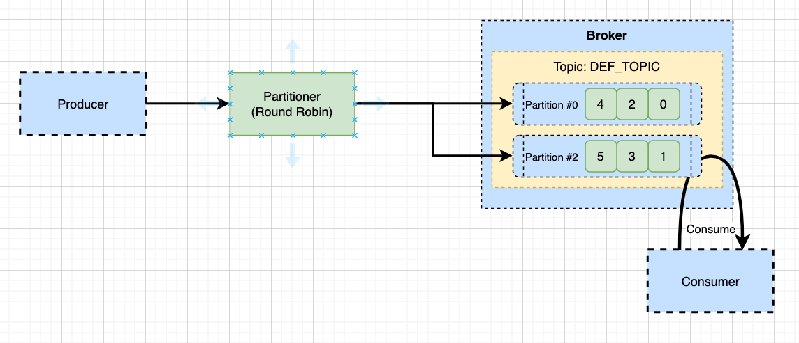

# Partion-Key

- 기본적으로 kafka는 key가 설정되지 않은경우, 메시지는 round robin 방식으로 파티션을 선택하여 메시지가 전달된다.
- key가 있다면 key값을 hashing하고 해싱 결과를 이용하여 파티션을 선택하도록 하고 있다.
- 만약 특정 메시지의 키에 따라 들어온 순서가 중요한 서비스라면, 키를 반드시 할당하고, 이들이 특정 파티션으로 분배되도록 지정해주는 용도로 사용할 수 있다.

## Message Key가 없는 경우
- 메시지가 들어오면 파티셔너가 메시지 키를 확인하고 메시지를 분산한다.
- 위와 같이 메시지 키가 없는경우 라운드로빈 방식으로 한번씩 파티션에 메시지를 할당한다.
- 메시지 번호를 보면 한번에 하나씩 메시지가 파티션에 할당됨을 확인할 수 있다.

## Message Key가 있는 경우
- 동일하게 파티셔너는 해싱을 통해서 메시지를 보낸다.
- 위와 같이 메시지 키가 있는경우 해싱을 위한 방식으로 파티션에 메시지를 할당한다.
- 메시지 번호가 서로 다르며, 키에 따라 들어온 순서대로 메시지가 적재 된다.

