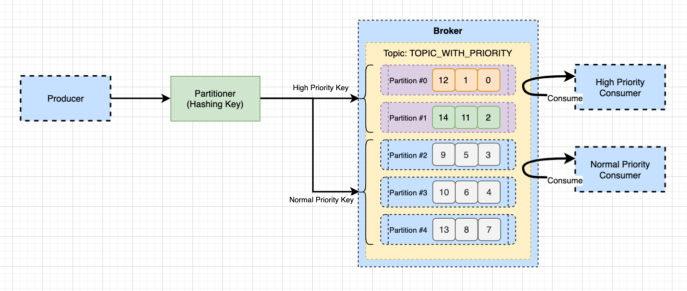

# Priority Queue
- 메시지를 프로듀싱 할때, 우선순위에 따라 별도로 메시지를 수신 받아야할 때가 있다.
- 동일한 토픽이지만 메시지 높은 우선순위를 설정해야하는 경우, 이 메시지는 별도로 처리가 필요하다.
- 일반 메시지는 일반 처리를 수행한다면 우리는 필요할때 우선순위 설정을 확인하고, 메시지를 빠르게 처리할 수 있을 것이다.

## 우선순위 메세지 수신 처리 방식
- 우선순위 메시지 수신은 키를 이용하여 파티션을 분리하는 방식을 이용한다.
- 동일 토픽에서 메시지를 수신할때, 메시지 키에 따라 메시지를 필터링하여 우선 처리해야할 작업을 수행하는 방식으로 이루어진다.

- 키에 따라 파티션에 메시지를 할당한다. 여기서 우선순위 파티션, 일반 순위 파티션으로 나눠지게 될 것이다.
- 컨슈머는 각각 컨슈머 그룹을 별도로 두고, 메시지를 컨슘한다.
- 이때 컨슈머는 필터링을 통해 우선순위 컨슈머, 일반 컨슈머들이 메시지를 처리할지 결정하고 메시지를 처리한다.